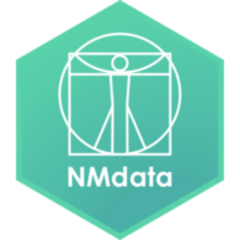
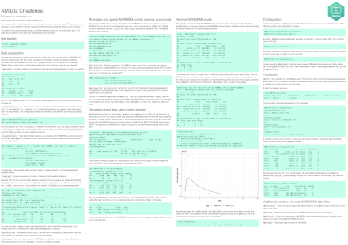
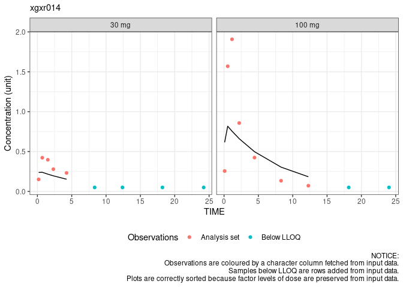
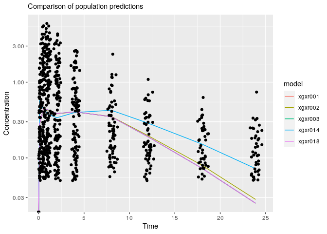

<!-- README.md is generated from README.Rmd. Please edit that file -->

# NMdata<a href='https://philipdelff.github.io/NMdata/'></a>

<!-- badges: start -->

[](https://lifecycle.r-lib.org/articles/stages.html)
[](https://github.com/philipdelff/NMdata/actions)
[](https://app.codecov.io/gh/philipdelff/NMdata?branch=master)
[](https://CRAN.R-project.org/package=NMdata)
[](https://cran.r-project.org/package=NMdata)
<!-- badges: end -->

## A fast R package for efficient data preparation, consistency-checking and post-processing in PK/PD modeling

Pharmacometrics and PK/PD modeling offers unique information for
decision-making in several steps of drug development. However, it often
takes a lot of work to get there, and there are many pitfalls along the
way. NMdata helps simplifying this work and steering around the pitfalls
or at least making sure we didn’t fall into them.

### Automate book keeping and focus on modeling

Preparing data sets - and if you use NONMEM, reading the results data -
can be tedious, and mistakes can lead to hours of frustration. NMdata
provides useful tools (including automated checks) for these trivial
tasks.

### NMdata is not a silo

Any functionality in the NMdata can be used independently of the rest of
the package, and NMdata is not intended to force you to change any
habits or preferences. Instead, NMdata tries to fit in with how you (or
your colleague who worked on the project before you) do things. It
likely provides helpful additions no matter what other tools you already
use.

### More information

The best place to browse information about the package is
[here](https://philipdelff.github.io/NMdata/). The quickest way in is
the
[Cheatsheet](https://htmlpreview.github.io/?https://github.com/philipdelff/NMdata/blob/master/vignettes/NMdata-cheat.html).

<!-- {width="15%"} -->
<!-- [Cheatsheet](https://htmlpreview.github.io/?https://github.com/philipdelff/NMdata/blob/master/devel/NMdata-cheat.html) -->

<a href="https://htmlpreview.github.io/?https://github.com/philipdelff/NMdata/blob/master/vignettes/NMdata-cheat.html"></a>

### How to install

`NMdata` is on [CRAN](https://cran.r-project.org/package=NMdata) and
[MPN](https://mpn.metworx.com/docs/packages/NMdata). To install from the
package archive you are already using, do:

    install.packages("NMdata")
    library(NMdata)

See further below for instructions on how to install from other sources
than your default archive, if need be.

## Prepare, check, and export PK/PD data

On the data-generation side, functionality is provided for documentation
of the datasets while generating them. Check out [this
vignette](https://philipdelff.github.io/NMdata/articles/DataPrepare.html)
on the topic. There are functions for automatic checks of (some) data
merges, handling and counting of exclusions flags, final preparations
for ensuring readability in NONMEM, and ensuring traceability of
datasets back to data generation scripts.

## Check data as read by NONMEM

The `NMcheckData` function will do an extensive and fully automated set
of checks of the data before you run NONMEM. And did NONMEM not behave?
`NMcheckData` can debug the data *as seen by NONMEM*. That’s right - it
has never been easier to find data bugs.

## Automated and general reader of NONMEM results data

Reading the resulting data from NONMEM can require a few manual steps.
Especially because all modelers seem to do things a little differently.
`NMscanData` can return all data output (`$TABLE`) from NONMEM combined,
and if wanted with additional columns and rows in input data. It’s as
simple as

``` r
res <- NMscanData("xgxr014.lst",recover.rows=TRUE)
#> Model:  xgxr014 
#> 
#> Used tables, contents shown as used/total:
#>               file      rows columns     IDs
#>    xgxr014_res.txt   905/905   12/12 150/150
#>  xgxr2.rds (input) 1502/1502   22/24 150/150
#>           (result)      1502    34+2     150
#> 
#> Input and output data merged by: ROW 
#> 
#> Distribution of rows on event types in returned data:
#>  EVID CMT input-only output result
#>     0   1          2      0      2
#>     0   2        595    755   1350
#>     1   1          0    150    150
#>   All All        597    905   1502
```

And we are ready to plot (a subset of) the result:

``` r
res.plot <- subset(res,ID%in%c(113,135)&EVID==0)
library(ggplot2)
ggplot(res.plot,aes(TIME))+
    geom_point(aes(y=DV,colour=flag))+
    geom_line(aes(y=PRED))+
    facet_wrap(~trtact)+
    labs(y="Concentration (unit)",colour="Observations",
         subtitle="NOTICE:\nObservations are coloured by a character column fetched from input data.\nSamples below LLOQ are rows added from input data.\nPlots are correctly sorted because factor levels of dose are preserved from input data.")+
    theme_bw()+theme(legend.position="bottom")
#> Warning: Removed 2 rows containing missing values (`geom_line()`).
```



Want a tibble instead? Easy:

``` r
res.tibble <- NMscanData("xgxr001.lst",as.fun=tibble::as_tibble,quiet=TRUE)
```

Or a data.table? This time, we’ll configure NMdata to return data.tables
by default:

``` r
NMdataConf(as.fun="data.table")
res.dt <- NMscanData("xgxr001.lst",quiet=TRUE)
```

`NMscanData` is very general, and should work with all kinds of models,
and all kinds of other software and configurations. Take a look at [this
vignette](https://philipdelff.github.io/NMdata/articles/NMscanData.html)
for more info on the NONMEM data reader. Then you will learn how to
access the meta data that will allow you to trace every step that was
taken combining the data and the many checks that were done along the
way too.

## Meta analysis made really easy

Since `NMscanData` is so general and will figure out where to find input
and output data on its own, let’s use the `NMscanMultiple` wrapper to
read multiple models and compare their predictions.

``` r
res <- NMscanMultiple(dir=system.file("examples/nonmem", package="NMdata"),
file.pattern="xgxr.*\\.lst",as.fun="data.table",quiet=TRUE)
gmean <- function(x)exp(mean(log(x)))
res.mean <- res[,.(gmeanPRED=gmean(PRED)),by=.(model,NOMTIME)]
obs.all <- unique(res[,.(ID,NOMTIME,TIME,DV)])
ggplot(res.mean,aes(NOMTIME,gmeanPRED,colour=model))+geom_line()+
    geom_point(aes(TIME,DV),data=obs.all,inherit.aes=FALSE)+
    scale_y_log10()+
    labs(x="Time",y="Concentration",subtitle="Comparison of population predictions")
#> Warning: Transformation introduced infinite values in continuous y-axis

#> Warning: Transformation introduced infinite values in continuous y-axis
```



## Get the most recent version

If your archive has not been updated since July 2021, you may not find
`NMdata` if you try to install with `install.packages` (option 1). In
that case you have two other options. You can explicitly select CRAN for
the installation. Or if you should want a version that has not yet
reached CRAN, installing from Github is easy too.

    ## Option 2: Install explicitly from CRAN
    install.packages("NMdata",repos="https://cloud.r-project.org")
    library(NMdata)

    ## Option 3: Install from github
    library(remotes)
    install_github("philipdelff/NMdata")
    library(NMdata)

If you use the Github version, you may want to see the
[FAQ](https://philipdelff.github.io/NMdata/articles/NMdata-FAQ.html) for
how to install specific releases from Github (ensuring reproducibility).

## Questions?

Check the
[FAQ](https://philipdelff.github.io/NMdata/articles/NMdata-FAQ.html), or
ask on [github](https://github.com/philipdelff/NMdata/)

## Issues?

The best way to report a bug or to request features is on
[github](https://github.com/philipdelff/NMdata/).

## Code of Conduct

Please note that the patchwork project is released with a [Contributor
Code of
Conduct](https://philipdelff.github.io/NMdata/CODE_OF_CONDUCT.html). By
contributing to this project, you agree to abide by its terms.
