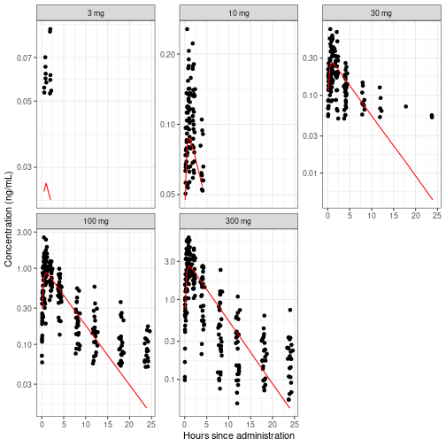

Built 2021-02-17 using NMdata 0.0.6.6.


## Introduction
Preparing data for analysis in `Nonmem` and reading the results back
into `R` can be time consuming. After a `Nonmem` run, a few tables may
have to be combined. Then we need character variables that are only
available in the input data file. And maybe the events ignored by
`Nonmem` (say, observations below quantification limit that we still
need in further analysis and plotting). 

This vignette focuses on how to use `NMdata` to automate what needs to
be trivial: get a dataset out of a `Nonmem` run, including discarded
columns and rows from the input data. In brevity, the most important
steps are

- Read and combine output tables
- If wanted, read input data and restore variables that were not
  output from the `Nonmem` model
- If wanted, also restore rows from input data that were disregarded
  in `Nonmem` (e.g. observations or subjects that are not part of the
  analysis)
  
In most cases, this is not too hard to do. But with the large degree
of flexibility `Nonmem` offer, there are a lot of caveats to be aware
of. The implementation in `NMdata` aims at preventing and
checking for as many of these caveats as possible. It is fast and
default argument values can be configured depending on your setup
(data standards, directory structure and other preferences).

Like the rest of `NMdata`, this functionality assumes as little as
possible about how you work. It assumes nothing about the `Nonmem`
model itself and as little as possible about the organization of data
and file paths/names. This makes it powerful for meta analyses, for
reading a model developed by someone else - or one written by
ourselves when we used to do things slightly differently. It will work
out of the box in the vast majority of cases.

For this vignette we initialize by attaching these packages and tweaking
plotting layout slightly:


```r
library(NMdata)
library(data.table)
#> data.table 1.13.6 using 2 threads (see ?getDTthreads).  Latest news: r-datatable.com
library(ggplot2)
theme_set(theme_bw()+theme(legend.position="bottom"))
```

<!-- For the purpose of this vignette we will configure `NMdata` not to check time -->
<!-- stamps of input control streams and input data against output control -->
<!-- streams. We need it because we cannot control -->
<!-- time stamps of the files in the distributed package. -->


## Get started
Try `NMscanData` on any model:


```r
res0 <- NMscanData(system.file("examples/nonmem/xgxr001.lst", package="NMdata"),
                   cbind.by.filters=TRUE)
#> Model:  xgxr001 
#> 
#> Tables, number of columns in tables, and their detail level:
#>            table used/total level
#>  xgxr001_res.txt      16/16   row
#>            input      22/22   row
#> 
#> Numbers of ID's and rows in data
#>       N From output tables From input data only
#>  N.rows                905                    0
#>   N.ids                150                    0
#> 
#> Distribution of rows on event types
#>  EVID From output tables
#>     0                755
#>     1                150
class(res0)
#> [1] "NMdata"     "data.frame"
```

`NMscanData` has read and combined input and output data and returned
a `data.frame`. The `NMdata` class allows for keeping additional
information in the object, but the object can be treated as a
`data.frame`. The `cbind.by.filters` means that we want `NMscanData`
to look at the `Nonmem` code (the output control stream) to figure out
what part of the input data was used by `Nonmem` for the model run (by
`$IGNORE` and `$ACCEPT` statements in `$DATA`). The same filtering is
then applied to the input data before adding columns to the output. In
fact, that argument is not necessary, this is default
behaviour. However, if we left it out, `NMscanData` would try to
explain this to you so you make an active choice what to do here. 

### Merge output and input data by a unique row identifier
The default method of interpreting `Nonmem` code is not recommended. It
is the default because it does not rely on assumptions about the input
data and hence very generic. It happens that this dataset and one of
the output tables contain a unique row identifier (a row counter in
the column called `ROW`). If we skipped the `cbind.by.filters` above,
`NMscanData` would figure this out and recommend merging by this
column. This is what we will now do using the `col.row` argument. The
following demonstrates that we get the same result from the two
methods. When using `col.row`, the row identifier is the first column
in the returned data. This is why the columns in `res0` are reordered
accordingly before the comparison. The way the reordering of columns
is done is a bit involved. It makes sure that if any columns in `res0`
are not in `res1`, these are not dismissed. It would be much easier to
use `data.table::setcolorder` but we are sticking to base R here.


```r
res1 <- NMscanData(system.file("examples/nonmem/xgxr001.lst", package="NMdata"),
                   col.row="ROW",quiet=TRUE)
res0 <- res0[,c(colnames(res1),setdiff(colnames(res0),colnames(res1)))]
all.equal(res0,res1,check.attributes=FALSE)
#> [1] TRUE
```
All features shown below will work whether you supply `col.row` or
not. We use `col.row` because it is more robust and always
recommended. 

Let's have a quick look at the data we got back. The following is done
with data.table. The comments in the code should make it
clear what happens if you are not familiar with `data.table`. You can
do this with `base::tapply`, `stats::aggregate`, a
combination of `dplyr::group_by` and `dplyr::summarize`, or whatever
you prefer. 


```r
## trtact is a character. Make it a factor with levels ordered by
## numerical dose level.
res1$trtact <- reorder(res1$trtact,res1$DOSE)
## We are going to use data.table
res1.dt <- as.data.table(res1)
## Derive geometric mean pop predictions by treatment and nominal
## sample time. Only use sample records. 
res1.mean <- res1.dt[EVID==0,.(gmPRED=exp(mean(log(PRED)))),
                     by=.(trtact,NOMTIME)]
## plot individual observations and geometric mean pop
## predictions. Split (facet) by treatment.
ggplot(subset(res1,EVID==0))+
    geom_point(aes(TIME,DV))+
    geom_line(aes(NOMTIME,gmPRED),data=res1.mean,colour="red")+
    scale_y_log10()+
    facet_wrap(~trtact,scales="free_y")+
    labs(x="Hours since administration",y="Concentration (ng/mL)")
```



We see that the obtained dataset contains both model
predictions (i.e. from output tables) and a character variable,
`trtact` (i.e. from input data). Only the .lst (output control stream)
file path was supplied by us. 

The data used for the example is a PK single ascending dose data set from the
[xgxr](https://cran.r-project.org/web/packages/xgxr/index.html)
package, kindly allowed by the xgxr team.


## More options and features
### Recover rows
You may have wondered why there is so little data on the small doses
in the plot of observations and geometric mean population predictions
above. The reason is that observations below the lower limit of
quantification have been disregarded. For this and many other reasons,
it is very common to use `ACCEPT` and `IGNORE` statements in the
`$INPUT` section of nonmem control streams. `NMscanData` can include
this data in the returned data object as well. Let's redo the plot
above taking advantage of this option. We will use `data.table` for
the calculations again, so we will reset the `as.fun` which we
set in the beginning to get `data.frame`'s. 


```r
NMdataConf(as.fun="data.table")
```


```r
res2 <- NMscanData(system.file("examples/nonmem/xgxr014.lst", package="NMdata"),
                   col.row="ROW",recover.rows=TRUE)
#> Model:  xgxr014 
#> 
#> Tables, number of columns in tables, and their detail level:
#>            table used/total level
#>  xgxr014_res.txt      12/12   row
#>            input      22/22   row
#> 
#> Numbers of ID's and rows in data
#>       N From input data only From output tables
#>  N.rows                  595                905
#>   N.ids                    0                150
#> 
#> Distribution of rows on event types
#>  EVID From input data only From output tables
#>     0                  595                755
#>     1                    0                150
## now we have a data.table
class(res2)
#> [1] "NMdata"     "data.table" "data.frame"
## Derive another data.table with geometric mean pop predictions by
## treatment and nominal sample time. Only use sample records.
res2.mean <- res2[EVID==0&nmout==TRUE,
                  .(gmPRED=exp(mean(log(PRED)))),
                  by=.(trtact,NOMTIME)]
## plot individual observations and geometric mean pop
## predictions. Split by treatment.
ggplot(res2[EVID==0])+
    geom_point(aes(TIME,DV,colour=flag))+
    geom_line(aes(NOMTIME,gmPRED),data=res2.mean)+
    scale_y_log10()+
    facet_wrap(~trtact,scales="free_y")+
    labs(x="Hours since administration",y="Concentration (ng/mL)")
```


Of course, this only works because a value has been assigned to the
(in this case) `DV` column for the observations below the
quantification limit. A couple of details are different compared to
when we read `res1`. For now, notice one thing changed when
calculating the population geometric means by nominal time and
dose. We included `nmout==TRUE`. `nmout` is a boolean column created
by `NMscanData` expressing whether the rows were in the output data
(`nmout==TRUE`) or they were recovered from the input data. `PRED` is
obviously not calculated for data rows neglected by `Nonmem`, so we
want to keep those out of the calculation. Let's see how many were
recovered


```r
## this is just a long-format representation of
## with(res1,table(nmout,flag)) using data.table.
res2[,.N,by=.(nmout,flag)]
#>    nmout         flag   N
#> 1:  TRUE Analysis set 905
#> 2: FALSE   Below LLOQ 595
```

So 905 rows were part of the analysis. 
The `recover.rows` argument can be used independently of whether
`col.row` is used.

### Combine multiple models
`NMscanData` by default adds a column called `model` for convenience
when working with multiple models. You can specify both column name
and content as arguments in `NMscanData`. You can also configure the
default column name and the function that generates the column content
by `NMdataConf`. If you don't, the column will be called `model`, and
the model name taken from the `lst` file name (say, `xgxr001`).  In
the following we use this to compare population predictions from two
different models. We read them again just to show the use of the
argument to name the models ourselves. Remember, we configure `NMdata`'s 
`as.fun` option so we are working with `data.table` and we
easily stack with `rbind` (`rbind.data.table`) filling in `NA`'s.


```r
NMdataConf(as.fun="data.table")
```


```r
## notice fill is an option to rbind with data.table
res1.m <- NMscanData(system.file("examples/nonmem/xgxr001.lst", package="NMdata"),
                     col.row="ROW",quiet=TRUE)
res2.m <- NMscanData(system.file("examples/nonmem/xgxr014.lst", package="NMdata"),
                     col.row="ROW",modelname="single-compartment",
                     quiet=TRUE)
res.mult <- rbind(res1.m,res2.m,fill=T)
res.mult.mean <- res.mult[EVID==0&nmout==TRUE,
                          .(gmPRED=exp(mean(log(PRED)))),
                          by=.(model,trtact,NOMTIME)]

ggplot(res.mult.mean,aes(NOMTIME,gmPRED,colour=model))+
    geom_line()+
    scale_y_log10()+
    facet_wrap(~trtact,scales="free_y")
```


### Use a row identifier or interpret `Nonmem` code
The most robust way to combine augment output data with input data
using `NMscanData` is to include a unique row identifier in both input
and at least one full-length output table. Then tell NMscanData to use
the row identifier using the `col.row` argument. The advantage is that
less `Nonmem` code has to be interpreted for this method. However,
notice that no checks are being done if the row identifier has been
modified during the `Nonmem` run. If you tell NMscanData that the column
called `ROW` is a to be used as the row identifier, and `ROW` is being
modified in say `$PK` before being output in an output table, this
will mess up the result. But if you keep the good practice of
including a unique row identifier in your dataset, the advice is to
include it in at least one output table. Tell `NMscanData` to use it
by the `col.row` argument.

### Preserve all input data properties
In the code above when plotting the population predictions together
with individual observations, we saw that character variables (the
treatment as dose with unit) was read from the input data file and was
used for splitting the plots. However, in order to sort the plots by
increasing dose level, we had to run `reorder` on the variable. This
is because the input data is read from a csv file and so factor levels
are not preserved. `NMscanData` will not code any character variables
as factors when reading from text files.

Since the character representation of treatment was already prepared,
it would be natural to encode the factor levels already at that
point. In order to preserve such information, we can use R's native
rds format. If the argument `use.rds` is `TRUE`, `NMscanData` will look for
an rds file next to the input data file (which is a delimited text
file) the exact same name as the text file except the extension must
be "`.rds`" rather than say "`.csv`" (for `Nonmem` and `NMscanData`, the
extension of the delimited text file doesn't matter). If it finds the
`rds` file, this will be used instead. No checks are done of whether the
contents are similar in any way to the delimited text file which is
ignored in this case. 

Return to the example above creating the dataset `dat2`. Notice the
message from NMscanData that an `rds` file was found. This is why we
could sort the plots correctly on the dose level with reordering the
factor levels first. There are three advantages of using rds files

- All attributes are kept. This includes column classes and factor levels.
- Reading speed may be improved (NMdata uses `fread` from `data.table`
  which is extremely fast for delimited files so in many cases this
  difference can be small).
- File sizes are greatly reduced from text to `rds`. This can be a big
  advantage if you are transfering files or reading over a network
  connection. `NMdata` is generally very fast (thanks to `data.table`)
  so file/network access (I/O) is likely to be the main bottleneck.

If you write `Nonmem` datasets with the `NMdata::NMwriteData`, you can
get an `rds` file automatically, exactly where `NMscanData` will look
for it. Creating datasets using `NMdata` is described in [this
vignette](https://philipdelff.github.io/NMdata/articles/DataCreate.html).


### Custom naming of input and output control streams
By default, `NMscanData` expects a
[PSN](https://uupharmacometrics.github.io/PsN/)-style naming of input
and output control streams. This means that if the input control
stream is called `model.mod`, the returned control stream is called
`model.lst`. If you use a different setup, you can use the `file.mod`
argument. Do one of the following if needed:

* Explicitly give the path to the input control stream or
* Pass a function that translates from the output control stream to
  the input. Example if the input is called `input.txt` and the output
  is called `output.txt`:


```r
out2in <- function(file) file.path(dirname(file),"input.txt")
res <- NMscanData("path/to/output.txt",file.mod=out2in)
```

You can use `NMdataConf` to configure the default behaviour to match your setup:

```r
NMdataConf(file.mod=out2in)
```


## What exactly will NMscanData return?
So far, the merge has been very straightforward, but in many
situations, choices are made by `NMscanData`. The following main
principles are followed:

* Output data prevails over input data
* Row-specific output data is preferred over ID-level (`FIRSTONLY` or
  `LASTONLY`) tables
* Output tables are prioritized by their order of apperance
* Input data is as defined in the `$INPUT` section in `Nonmem`. This
  includes renaming of columns while columns that are dropped in
  `Nonmem` (`DROP` or `SKIP`) are included by `NMscanData`. Columns that
  are not included in `$INPUT` are named as in the input data file.
* If rows are being recovered from input data (the `recover.rows`
  argument), no information from output is merged onto these rows.
* The primary aim is to return the output data. If input and output
  cannot be meaningfully combined (very rare), output will be
  returned.
  
Notice that the summary text printed to the `R` terminal by
`NMscanData` tells how many columns are included from the available
tables. Also, within the resulting object, you can find a detailed
table of all variables available, and whether they are included or
not.


```r
print(attributes(res1.m)$meta$variables,topn=3)
#>     variable           table     source level COLNUM
#>  1:      ROW xgxr001_res.txt     output   row      1
#>  2:       ID           input      input   row      2
#>  3:  NOMTIME           input      input   row      3
#> ---                                                 
#> 40:    model            <NA> NMscanData model     40
#> 41:      ROW           input      input   row     NA
#> 42:       DV           input      input   row     NA
```

## The building blocks
Each of the steps involved in reading and combining the data from a
model run can be done separately. 

The `lst` file was scanned for output tables, and they were all read
(including interpreting the possible `firstonly` option). The input data
has been used based on the `$DATA` and `$INPUT` sections of the control
stream. The key steps in this process are available as independent
functions. 

- `NMreadTab`: Read an `Nonmem` output table based on the path to the output
  table file.

- `NMscanTables`: Read all output data files defined in a `Nonmem`
  run. Return a list of tables (as data.frames or data.tables).

- `NMtransInput`: Read input data based on a `Nonmem` file. Data will be
  processed and named like the `Nonmem` model. `ACCEPT` and `IGNORE` filters
  can be applied as well. There are a few limitations to this
  functionality at this point. More about them below.


## What should I do for my models to be compatible with NMscanData?
The answer to this should be as close to "nothing" as possible -
that's more or less the aim of the function. You just have to make
sure that the information that you need is present in input data and
output data. No need to output information that is unchanged from
input, but make sure to output what you need (like `IPRED`, `CWRES`, `CL`,
`ETA1` etc which cannot be found in input). Some of these values can be
found from other files generated by `Nonmem` but notice: `NMscanData` uses
only input and output data.

It is recommended to always use a unique row identifier in both input and
output data. This is the most robust way to merge back with input
data. In firstonly tables, include the subject ID. Again, everything
will most likely work even if you don't, I personally don't like
relying on "most likely" when I can just as well have robustness.


## Limitations
Even if there are a few limitations to what models `NMscanData` can
handle, there is a good chance you will never run into any of them, as
they are mostly quite rare. If you do, reach out to me, and we'll
figure it out.

### Input file must exist and be unmodified since model run
If merging with input data, the input data must be available as was
when the model was run. If you want to avoid this potential issue,
`Nonmem` can be run in a wrapper script that either copies the input
data, or runs `NMscanData` and saves the output in a compressed file
format (like `rds` or `zip`).

### Not all data filter statements implemented
Nested `ACCEPT` and `IGNORE` statements are not supported at this
point. The resulting number of rows after applying filters is checked
against row-level output table dimensions (if any available). In other
words, you have to be unlucky to run into trouble without an
error. But it is alway recommended to use a unique row identifier in
both input and output tables in order to avoid relying on
interpretation of `Nonmem` code.

The `RECORDS` and `NULL` options in `$DATA` are not implemented. If using
`RECORDS`, please use the `col.row` option to merge by a unique row
identifier.

### Character time variables not interpreted
`Nonmem` supports a clocktime input format for a column called TIME in
input data. Based on a day counter and a character ("00:00") clock
format, `Nonmem` can calculate the individual time since first
record. This behaviour is not mimicked by NMscanData, and the only
ways to get TIME in this case are to either include it in an output
`TABLE` or to code the translation yourself after calling
`NMscanData`. Of course, this is on the todo list.

### Some TABLE options not supported
For now, only output tables returning either all rows or one row per
subject can be merged with input. Tables written with options like
`FIRSTLASTONLY` (two rows per subject) and `OBSONLY` are disregarded
with a warning (you can read them with `NMscanTables`). `LASTONLY` is
treated like `FIRSTONLY`, i.e. as ID-level information if not
available elsewhere.
